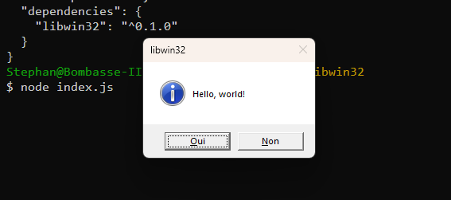

# libwin32 (work in progress)
> Node bindings to native Win32 DLLs through [Koffi](https://koffi.dev).

````js
import { MessageBox } from 'libwin32'
import { MB_ } from 'libwin32/consts'

const result = MessageBox(
    null,
    "Hello, world!",
    "libwin32",
    MB_.ICONINFORMATION | MB_.YESNO
)
````




### In a nutshell:
* Very simple and intuitive API (see [demos](./source//demos/)), with TypeScript definitions included.
* Bundler friendly, designed with tree-shakeability in mind.
* Opinionated:
    * Only targets **64-bit** platforms (*Intel/AMD for now, ARM may be added later, no warranty though*).
    * Only exposes **Unicode** functions and data structures (those whose name ends in `W` in the Win32 API).
* Very easy to extend with additional functions, data structures and constants. I will add some myself time permitting; any help would be *mucho* appreciated. **If you can't or won't submit a PR yourself, just head to [#8](https://github.com/Septh/libwin32/issues/8) and kindly ask :)**.


### How to...

#### > Use the lib in your code
1. Install the lib in your project: `npm install libwin32`
1. Import the functions and types you need. You may either import from `libwin32` or from `libwin32/<dllname>` (without the `.dll` extension) if you know which dll a function belongs to. For example, `import { MessageBox } from 'libwin32'` and `import { MessageBox } from 'libwin32/user32'` would both work.
1. (optional) Import some complementary constants. They greatly simplify calls to the Win32 API.
    * All constants are available via the `libwin32/consts` import.
    * Logically grouped constants are exported as `enum`s, where the prefix is the name of the enum. For instance, `WM_DESTROY` and `WM_KEYDOWN` are members of the `WM_` enum and can be accessed as `WM_.DESTROY` and `WM_.KEYDOWN`, respectively.
1. Call the functions as instructed by the [Win32 API documentation](https://learn.microsoft.com/en-us/windows/win32/api/).
    * All functions, constants and types are named accordingly and the lib is fully typed so you may rely on code hints from your editor.
    * Many Win32 C structures have a size member (often named `cbSize`) that must be set before they are used as a parameter. For these, the lib provide a JS class that automatically sets that field when instantiated. See `WNDCLASSEX` for an example.
    * There are a few cases where it made sense to transform the C prototype to something more JS-friendly. For instance, in C, `GetWindowText()` fills in a buffer whose address is passed as the second parameter to the function; in JS/TS, the function takes only one parameter and returns a string.

#### > Bundle the lib with your code
The Win32 API has thousands of functions, structures and constants. While providing bindings for all of them is *not* a goal, the lib may eventually grow to something very, very big.

To accommodate this, `libwin32` is "tree-shakeable by design". This feature relies on [Rollup's awesome tree-shaking capabilities](https://rollupjs.org/introduction/#tree-shaking).

See [rollup.demos.js](../rollup.demos.js) to see how it's done, and build the demos (see below) to see the resulting code in the `/demos` directory.

#### > Build the lib

````shell
$ git clone https://github.com/Septh/libwin32.git
$ cd libwin32
$ npm install
$ npm run build
````

The output goes to `/lib`.

#### > Run the demos
Build the lib, then:

* Without bundling:
````shell
$ node lib/demos/<demoname>.js
````

* With bundling:
````shell
$ npm run build:demos
$ node demos/<demoname>/<demoname>.js
````

### Changelog
See [releases](https://github.com/Septh/libwin32/releases) on Github.

### Bindings so far
*All functions come with their associated types and constants.*

#### Added in 0.6.0
* advapi32.dll
    * GetTokenInformation
    * GetUserName
    * LookupAccountSid
    * LsaClose
    * LsaNtStatusToWinError
    * LsaOpenPolicy
    * OpenProcessToken
* kernel32.dll
    * Beep
    * GetComputerName
    * GetModuleFileName

#### Added in 0.5.0
*Many thanks to [@MomoRazor](https://github.com/MomoRazor) for the impressive work on [53e99ef](https://github.com/Septh/libwin32/commit/53e99ef3ef63298e3b84ec1835acdbf61810296e)!*

* kernel32.dll
    * CloseHandle
    * FormatMessage
    * GetCurrentProcess
    * GetModuleHandleEx
    * GetWindowThreadProcessId
    * OpenProcess
    * QueryFullProcessImageName
    * SetLastError

#### Added in 0.4.0
*Many thanks to [@shrirajh](https://github.com/shrirajh) for the impressive work on [b2bf65b](https://github.com/Septh/libwin32/commit/b2bf65b6d20dbe7dae4e48341176a8407c135c46)!*
* user32.dll
    * AppendMenu
    * CheckMenuItem
    * CreatePopupMenu
    * DestroyMenu
    * GetCursorPos
    * SendMessage
    * SetForegroundWindow
    * TrackPopupMenu
* shell32.dll
    * Shell_NotifyIcon

#### Added in 0.3.0
* user32.dll
    * AdjustWindowRect
    * AdjustWindowRectEx
    * AnimateWindow
    * BringWindowToTop
    * BroadcastSystemMessage
    * BroadcastSystemMessageEx
    * CallWindowProc
    * EnumWindows
    * FindWindow
    * FindWindowEx
    * GetAncestor
    * GetClassInfo
    * GetClassInfoEx
    * GetClassName
    * GetWindowText

#### Added in 0.2.0
None.

#### Since 0.1.0
* kernel32.dll
    * GetLastError
    * GetModuleHandle
* user32.dll
    * CreateWindow
    * CreateWindowEx
    * DefWindowProc
    * DestroyCursor
    * DestroyIcon
    * DispatchMessage
    * GetMessage
    * LoadCursor
    * LoadIcon
    * LoadImage
    * MessageBox
    * PostQuitMessage
    * RegisterClass
    * RegisterClassEx
    * ShowWindow
    * ShowWindowAsync
    * TranslateMessageEx
    * UnregisterClass
    * UpdateWindow

### Repository structure
* `./source/win32`:
    * The main bindings source files.
* `./source/demos`:
    * Some usage examples.
* `./source/rollup`:
    * Two [Rollup](https://rollup.org) plugins to ease the process of bundling this library with your own code and to boost its tree-shakeability. See [rollup.demos.js](../rollup.demos.js) to see how to use.

### Licence
MIT.
