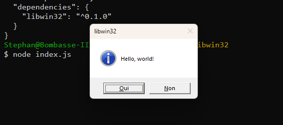

# libwin32 (work in progress)
> Node bindings to native Win32 DLLs through [Koffi](https://koffi.dev).

### In a nutshell:
* Very simple and intuitive API (see [demo](./source//demos/window.ts)), with TypeScript definitions included.
* Bundler friendly, designed with tree-shakeability in mind.
* Opinionated:
    * Only targets **x64** platforms (*ARM-64 may be added later, no warranty though*).
    * Only exposes **Unicode** functions and data structures (those whose name ends in `W` in the Win32 API).
* Very easy to extend with additional functions, data structures and constants. I will add some myself time permitting; any help would be *mucho* appreciated.


### How to...

#### > Use the lib in your code
1. Install the lib in your project: `npm install libwin32`
1. Import the functions, constants and types you need. You may either import from `libwin32` or from `libwin32/<dllname>` (without the `.dll` extension). Currently, only two dlls are available: `kernel32` and `user32`.
1. Call the functions as instructed by the [Win32 API documentation](https://learn.microsoft.com/en-us/windows/win32/api/). All functions, constants and types are named accordingly.
    * Constants like `WM_DESTROY` are exported as `const enum`s, where the prefix is the name of the enum. Eg, `WM_DESTROY` and `WM_KEYDOWN` are exported as `WM.DESTROY` and `WM_KEYDOWN` (if you use TypeScript, you may want to set `preserveConstEnmums = false` in `tsconfig.json`).

A very basic example:

````js
import { MessageBox, MB } from 'libwin32'

const result = MessageBox(
    null,
    "Hello, world!",
    "libwin32",
    MB.ICONQUESTION | MB.HELP | MB.YESNO
)
console.dir(result)
````

Result:



#### > Build the lib

````shell
$ git clone https://github.com/Septh/libwin32.git
$ cd libwin32
$ npm install
$ npm run build
````

The output goes to `/dist` for the library, and `/demos` for the demos.

#### > See the demos
Build the lib, then:

* Without bundling:
````shell
$ node dist/demos/window.js
$ node dist/demos/messagebox.js
````

With bundling:
* Build the lib, then:
````shell
$ npm run build:demos
$ node demos/window/window.js
$ node demos/messagebox/messagebox.js
````

### Directories
* `./source/win32`:
    * The main bindings source files.
* `./source/demos`:
    * Some usage examples. (*only two at the time, more to come later*)
* `./source/rollup`:
    * A [Rollup](https://rollup.org) plugin to ease the process of bundling this library with your code. This targets the *consumers* of the library, not the library itself. (*more info to come*).
* `./source/stubs`:
    * Used for efficient bundling of Koffi with `Rollup`.
